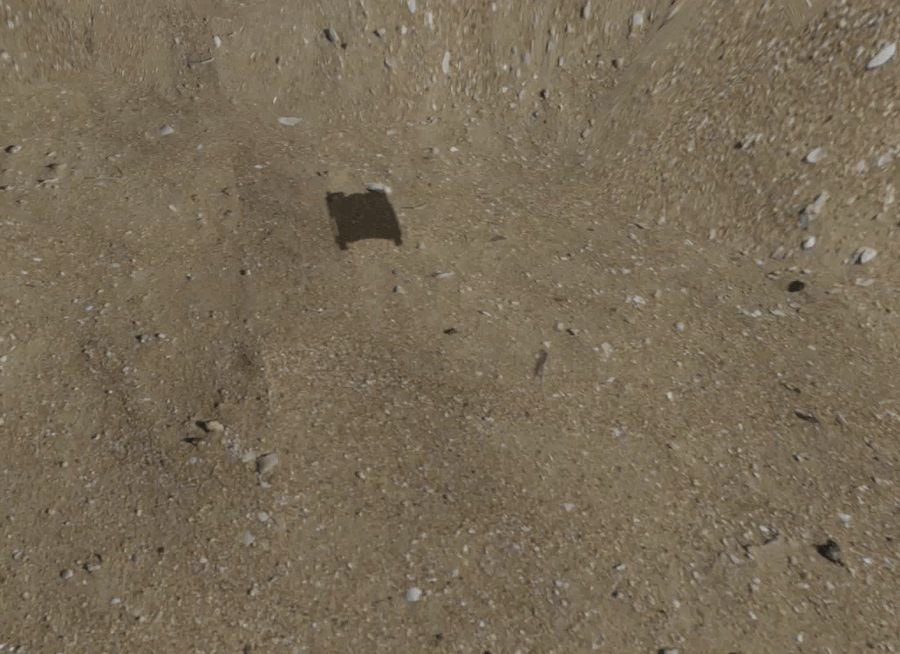
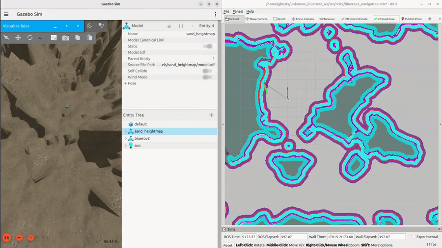

# unknown_BlueROV2

<p align="center">
  
</p>

BlueROV2 underwater robot simulation project using **ROS 2 Jazzy**, **Gazebo Harmonic**, **SLAM Toolbox**, **Nav2**, and **robot_localization EKF**.

This project demonstrates:

- BlueROV2 underwater simulation in Gazebo Harmonic
- ROS 2 bridge from Gazebo to ROS 2
- Simulated DVL velocity generated from odometry
- IMU, depth, odometry, and 2D lidar integration
- EKF localization using `robot_localization`
- 2D lidar mapping with SLAM Toolbox
- Saved-map navigation with Nav2 and AMCL
- `/cmd_vel` to BlueROV2 thruster control
- Automatic depth control for vertical thrusters
- Custom Gazebo underwater world and BlueROV2 model

---

## System Requirements

Tested with:

- Ubuntu 24.04
- ROS 2 Jazzy
- Gazebo Harmonic
- SLAM Toolbox
- Nav2
- robot_localization
- ros_gz_bridge
- RViz2
- Python 3

---

## Repository Structure

```text
unknown_bluerov2_ws/
├── README.md
├── .gitignore
├── assets/
│   ├── bluerov2_drive.gif
│   ├── bluerov2_mapping.gif
│   └── bluerov2_navigation.gif
└── src/
    ├── bluerov2_gz/
    │   ├── models/
    │   │   ├── axes/
    │   │   ├── bluerov2/
    │   │   ├── bluerov2_heavy/
    │   │   ├── bluerov2_ping/
    │   │   └── sand_heightmap/
    │   ├── worlds/
    │   │   ├── bluerov2_underwater.world
    │   │   ├── bluerov2_heavy_underwater.world
    │   │   └── bluerov2_ping.world
    │   ├── scripts/
    │   ├── params/
    │   ├── images/
    │   ├── package.xml
    │   └── CMakeLists.txt
    ├── rviz2/
    │   ├── bluerov2_mapping.rviz
    │   └── bluerov2_navigation.rviz
    ├── unknown_bluerov2_bringup/
    │   ├── unknown_bluerov2_bringup/
    │   │   ├── gazebo.launch.py
    │   │   └── bridge.launch.py
    │   ├── package.xml
    │   ├── setup.py
    │   └── setup.cfg
    ├── unknown_bluerov2_description/
    │   ├── unknown_bluerov2_description/
    │   │   └── __init__.py
    │   ├── package.xml
    │   ├── setup.py
    │   └── setup.cfg
    └── unknown_bluerov2_nav/
        ├── config/
        │   ├── ekf_dvl_imu_depth.yaml
        │   ├── nav2_saved_map_params.yaml
        │   ├── nav2_slam_params.yaml
        │   └── slam_toolbox.yaml
        ├── launch/
        │   ├── depth_control.launch.py
        │   ├── ekf_localization.launch.py
        │   ├── mapping.launch.py
        │   ├── nav2_saved_map.launch.py
        │   ├── nav2_slam.launch.py
        │   ├── static_tf.launch.py
        │   ├── tf_with_odom.launch.py
        │   └── thruster_mixer.launch.py
        ├── maps/
        │   ├── bluerov2_slam_map.yaml
        │   └── bluerov2_slam_map.pgm
        ├── unknown_bluerov2_nav/
        │   ├── cmd_vel_thruster_mixer.py
        │   ├── depth_thruster_controller.py
        │   ├── odom_tf_publisher.py
        │   ├── odom_to_depth_pose.py
        │   ├── odom_to_dvl_twist.py
        │   └── wait_for_nav_ready.py
        ├── package.xml
        ├── setup.py
        └── setup.cfg
```

---

# Clone This Repository

```bash
cd ~
git clone https://github.com/wattanatum/unknown_BlueROV2.git unknown_bluerov2_ws
cd ~/unknown_bluerov2_ws
```

---

# Install Project Dependencies

```bash
sudo apt update

sudo apt install -y \
  ros-jazzy-ros-gz-bridge \
  ros-jazzy-ros-gz-sim \
  ros-jazzy-slam-toolbox \
  ros-jazzy-navigation2 \
  ros-jazzy-nav2-bringup \
  ros-jazzy-robot-localization \
  ros-jazzy-tf2-ros \
  ros-jazzy-tf2-tools \
  ros-jazzy-rviz2 \
  ros-jazzy-nav-msgs \
  ros-jazzy-geometry-msgs \
  ros-jazzy-sensor-msgs \
  ros-jazzy-std-msgs \
  ros-jazzy-tf2-msgs \
  python3-colcon-common-extensions \
  python3-rosdep \
  python3-pip
```

The DVL in this project is simulated by the custom node:

```text
unknown_bluerov2_nav/odom_to_dvl_twist.py
```

No separate DVL package is required.

---

# Build ROS 2 Workspace

```bash
cd ~/unknown_bluerov2_ws
colcon build --symlink-install
source install/setup.bash
```

To source automatically every new terminal:

```bash
echo "source ~/unknown_bluerov2_ws/install/setup.bash" >> ~/.bashrc
source ~/.bashrc
```

---

# Run BlueROV2 Gazebo Simulation

Open terminal 1:

```bash
source ~/unknown_bluerov2_ws/install/setup.bash
ros2 launch unknown_bluerov2_bringup gazebo.launch.py
```

This launch starts Gazebo Harmonic with:

```text
src/bluerov2_gz/worlds/bluerov2_underwater.world
```

Expected Gazebo / bridge source topics include:

```text
/clock
/scan
/model/bluerov2/odometry
/model/bluerov2/odometry_with_covariance
/world/bluerov2_underwater/model/bluerov2/link/base_link/sensor/imu_sensor/imu
```

---

# Run Gazebo to ROS 2 Bridge

Open terminal 2:

```bash
source ~/unknown_bluerov2_ws/install/setup.bash
ros2 launch unknown_bluerov2_bringup bridge.launch.py
```

This bridge creates ROS 2 topics:

```text
/clock
/imu
/scan
/odom
/thruster1/cmd_thrust
/thruster2/cmd_thrust
/thruster3/cmd_thrust
/thruster4/cmd_thrust
/thruster5/cmd_thrust
/thruster6/cmd_thrust
```

Check topics:

```bash
ros2 topic list
```

Check odometry:

```bash
ros2 topic echo /odom --once
```

Check lidar:

```bash
ros2 topic echo /scan --once
```

Check IMU:

```bash
ros2 topic echo /imu --once
```

---

# Static TF

Open terminal 3:

```bash
source ~/unknown_bluerov2_ws/install/setup.bash
ros2 launch unknown_bluerov2_nav static_tf.launch.py
```

This publishes:

```text
base_link -> imu_link
base_link -> dvl_link
base_link -> depth_link
base_link -> laser_link
```

Check:

```bash
ros2 run tf2_ros tf2_echo base_link laser_link
ros2 run tf2_ros tf2_echo base_link imu_link
ros2 run tf2_ros tf2_echo base_link dvl_link
ros2 run tf2_ros tf2_echo base_link depth_link
```

---

# Optional Odom TF Publisher

If you need `odom -> base_link` from raw `/odom`, run:

```bash
source ~/unknown_bluerov2_ws/install/setup.bash
ros2 launch unknown_bluerov2_nav tf_with_odom.launch.py
```

This starts the static TFs and:

```text
unknown_bluerov2_nav/odom_tf_publisher.py
```

Manual run:

```bash
ros2 run unknown_bluerov2_nav odom_tf_publisher \
  --ros-args \
  -p use_sim_time:=true \
  -p odom_topic:=/odom \
  -p parent_frame:=odom \
  -p child_frame:=base_link
```

Important:

Do not publish `odom -> base_link` from two places at the same time.

If EKF publishes `odom -> base_link`, do not run `odom_tf_publisher`.

Check EKF TF setting:

```bash
ros2 param get /ekf_filter_node publish_tf
```

---

# EKF Localization

Run EKF and sensor conversion nodes:

```bash
source ~/unknown_bluerov2_ws/install/setup.bash
ros2 launch unknown_bluerov2_nav ekf_localization.launch.py
```

This launch starts:

```text
odom_to_dvl_twist
odom_to_depth_pose
ekf_filter_node
```

The sensor conversion nodes generate:

```text
/dvl/twist
/depth/pose
```

The EKF output is:

```text
/odometry/filtered
```

Check simulated DVL:

```bash
ros2 topic echo /dvl/twist --once
```

Check depth pose:

```bash
ros2 topic echo /depth/pose --once
```

Check EKF output:

```bash
ros2 topic echo /odometry/filtered --once
```

Check TF:

```bash
ros2 run tf2_ros tf2_echo odom base_link
```

> Note: if `/dvl/twist` or `/depth/pose` does not publish, check the odometry topic used in `src/unknown_bluerov2_nav/launch/ekf_localization.launch.py`. If your bridge only publishes `/odom`, set `input_odom_topic` to `/odom`.

---

# Depth Control

The project includes depth control for the vertical thrusters.

Run depth controller:

```bash
source ~/unknown_bluerov2_ws/install/setup.bash
ros2 launch unknown_bluerov2_nav depth_control.launch.py
```

This launch starts:

```text
depth_thruster_controller
```

The depth controller reads odometry from:

```text
/odom
```

and sends thrust commands to:

```text
/thruster5/cmd_thrust
/thruster6/cmd_thrust
```

Default depth behavior is configured in:

```text
src/unknown_bluerov2_nav/launch/depth_control.launch.py
```

Important parameters:

```text
mapping_depth_m: 9.0
shutdown_depth_m: 2.0
kp_depth: 20.0
max_thrust: 150.0
min_active_thrust: 20.0
depth_tolerance_m: 0.15
```

Check odometry used for depth:

```bash
ros2 topic echo /odom --once
```

Check vertical thruster output:

```bash
ros2 topic echo /thruster5/cmd_thrust
ros2 topic echo /thruster6/cmd_thrust
```

---

# Thruster Mixer

The thruster mixer converts Nav2 `/cmd_vel` commands into BlueROV2 horizontal thruster commands.

Typical flow:

```text
Nav2 /cmd_vel -> cmd_vel_thruster_mixer -> Gazebo thrusters
```

Run thruster mixer:

```bash
source ~/unknown_bluerov2_ws/install/setup.bash
ros2 launch unknown_bluerov2_nav thruster_mixer.launch.py
```

This launch starts the node:

```text
/cmd_vel_to_thrusters
```

The mixer subscribes to:

```text
/cmd_vel
```

and publishes to:

```text
/thruster1/cmd_thrust
/thruster2/cmd_thrust
/thruster3/cmd_thrust
/thruster4/cmd_thrust
```

Important parameters are configured in:

```text
src/unknown_bluerov2_nav/launch/thruster_mixer.launch.py
```

Important parameters:

```text
linear_gain
yaw_gain
max_thrust
force_forward_only
block_rotate_in_place
invert_yaw
yaw_deadband
max_yaw_when_moving
yaw_scale_when_moving
```

Check Nav2 velocity:

```bash
ros2 topic echo /cmd_vel
```

Check mixer node:

```bash
ros2 node list | grep cmd_vel
```

Check mixer node info:

```bash
ros2 node info /cmd_vel_to_thrusters
```

Manual forward test:

```bash
ros2 topic pub /cmd_vel geometry_msgs/msg/Twist \
"{linear: {x: 0.2}, angular: {z: 0.0}}" -r 10
```

Manual yaw test:

```bash
ros2 topic pub /cmd_vel geometry_msgs/msg/Twist \
"{linear: {x: 0.0}, angular: {z: 0.2}}" -r 10
```

Stop command:

```bash
ros2 topic pub /cmd_vel geometry_msgs/msg/Twist \
"{linear: {x: 0.0}, angular: {z: 0.0}}" --once
```

Check horizontal thruster output:

```bash
ros2 topic echo /thruster1/cmd_thrust
ros2 topic echo /thruster2/cmd_thrust
ros2 topic echo /thruster3/cmd_thrust
ros2 topic echo /thruster4/cmd_thrust
```

---

# SLAM Toolbox Mapping

<p align="center">
  
</p>

Use this mode to create a new map.

Do not run saved-map navigation at the same time as SLAM Toolbox mapping.

## Terminal 1: Launch Gazebo

```bash
source ~/unknown_bluerov2_ws/install/setup.bash
ros2 launch unknown_bluerov2_bringup gazebo.launch.py
```

## Terminal 2: Launch Bridge

```bash
source ~/unknown_bluerov2_ws/install/setup.bash
ros2 launch unknown_bluerov2_bringup bridge.launch.py
```

## Terminal 3: Launch TF + Odom

```bash
source ~/unknown_bluerov2_ws/install/setup.bash
ros2 launch unknown_bluerov2_nav tf_with_odom.launch.py
```

## Terminal 4: Launch Thruster Mixer

```bash
source ~/unknown_bluerov2_ws/install/setup.bash
ros2 launch unknown_bluerov2_nav thruster_mixer.launch.py
```

## Terminal 5: Launch Depth Control

```bash
source ~/unknown_bluerov2_ws/install/setup.bash
ros2 launch unknown_bluerov2_nav depth_control.launch.py
```

## Terminal 6: Launch SLAM Toolbox

```bash
source ~/unknown_bluerov2_ws/install/setup.bash
ros2 launch unknown_bluerov2_nav mapping.launch.py
```

## Terminal 7: Launch Nav2 for SLAM

```bash
source ~/unknown_bluerov2_ws/install/setup.bash
ros2 launch unknown_bluerov2_nav nav2_slam.launch.py
```

## Terminal 8: RViz2

```bash
source ~/unknown_bluerov2_ws/install/setup.bash
rviz2 -d ~/unknown_bluerov2_ws/src/rviz2/bluerov2_mapping.rviz
```

If the RViz config does not load, run:

```bash
rviz2
```

Then set:

```text
Fixed Frame: map
```

Useful displays:

```text
/map
/scan
/tf
/odometry/filtered
/local_costmap/costmap
/global_costmap/costmap
/plan
```

---

# Save SLAM Map

After mapping, save the map:

```bash
cd ~/unknown_bluerov2_ws/src/unknown_bluerov2_nav/maps
ros2 run nav2_map_server map_saver_cli -f bluerov2_slam_map
```

Expected files:

```text
bluerov2_slam_map.yaml
bluerov2_slam_map.pgm
```

Rebuild after saving maps:

```bash
cd ~/unknown_bluerov2_ws
colcon build --packages-select unknown_bluerov2_nav --symlink-install
source install/setup.bash
```

---

# Nav2 Saved-Map Navigation

<p align="center">
  
</p>

Use this mode after a map has already been created.

Do not run SLAM Toolbox during saved-map navigation.

## Terminal 1: Launch Gazebo

```bash
source ~/unknown_bluerov2_ws/install/setup.bash
ros2 launch unknown_bluerov2_bringup gazebo.launch.py
```

## Terminal 2: Launch Bridge

```bash
source ~/unknown_bluerov2_ws/install/setup.bash
ros2 launch unknown_bluerov2_bringup bridge.launch.py
```

## Terminal 3: Launch TF + Odom

```bash
source ~/unknown_bluerov2_ws/install/setup.bash
ros2 launch unknown_bluerov2_nav tf_with_odom.launch.py
```

## Terminal 4: Launch Thruster Mixer

```bash
source ~/unknown_bluerov2_ws/install/setup.bash
ros2 launch unknown_bluerov2_nav thruster_mixer.launch.py
```

## Terminal 5: Launch Depth Control

```bash
source ~/unknown_bluerov2_ws/install/setup.bash
ros2 launch unknown_bluerov2_nav depth_control.launch.py
```

## Terminal 6: Nav2 Saved Map

```bash
source ~/unknown_bluerov2_ws/install/setup.bash
ros2 launch unknown_bluerov2_nav nav2_saved_map.launch.py
```

This launch starts saved-map localization and navigation nodes such as:

```text
map_server
amcl
controller_server
smoother_server
planner_server
behavior_server
bt_navigator
wait_for_nav_ready
lifecycle_manager_localization
lifecycle_manager_navigation
```

## Terminal 7: RViz2

```bash
source ~/unknown_bluerov2_ws/install/setup.bash
rviz2 -d ~/unknown_bluerov2_ws/src/rviz2/bluerov2_navigation.rviz
```

In RViz2:

```text
Fixed Frame: map
```

Use:

```text
2D Pose Estimate
```

to set the initial pose if AMCL does not localize automatically.

Then use:

```text
Nav2 Goal
```

to send a navigation goal.

---

# Check Nav2 Lifecycle

Check if Nav2 nodes are active:

```bash
ros2 lifecycle get /map_server
ros2 lifecycle get /amcl
ros2 lifecycle get /controller_server
ros2 lifecycle get /planner_server
ros2 lifecycle get /behavior_server
ros2 lifecycle get /bt_navigator
```

Expected:

```text
active [3]
```

During SLAM mode, `/map_server` and `/amcl` may not be running. They are mainly for saved-map navigation.

---

# Check TF Tree

Required TF tree for mapping and saved-map navigation:

```text
map -> odom -> base_link -> laser_link
```

Check:

```bash
ros2 run tf2_ros tf2_echo odom base_link
ros2 run tf2_ros tf2_echo map odom
ros2 run tf2_ros tf2_echo map base_link
ros2 run tf2_ros tf2_echo base_link laser_link
```

Notes:

- During mapping, `map -> odom` is published by SLAM Toolbox.
- During saved-map navigation, `map -> odom` is published by AMCL.
- `odom -> base_link` is published by EKF or `odom_tf_publisher`.
- `base_link -> laser_link` is published by static TF.

---

# Check Important ROS 2 Topics

Check map:

```bash
ros2 topic echo /map --once
```

Check scan:

```bash
ros2 topic echo /scan --once
```

Check raw odom:

```bash
ros2 topic echo /odom --once
```

Check EKF odom:

```bash
ros2 topic echo /odometry/filtered --once
```

Check simulated DVL:

```bash
ros2 topic echo /dvl/twist --once
```

Check depth pose:

```bash
ros2 topic echo /depth/pose --once
```

Check AMCL pose:

```bash
ros2 topic echo /amcl_pose --once
```

Check Nav2 velocity:

```bash
ros2 topic echo /cmd_vel
```

Check global plan:

```bash
ros2 topic echo /plan --once
```

Generate TF frames PDF:

```bash
ros2 run tf2_tools view_frames
```

---

# Manual Bridge Command

Normally use:

```bash
ros2 launch unknown_bluerov2_bringup bridge.launch.py
```

Manual equivalent:

```bash
ros2 run ros_gz_bridge parameter_bridge \
  /clock@rosgraph_msgs/msg/Clock[gz.msgs.Clock \
  /world/bluerov2_underwater/model/bluerov2/link/base_link/sensor/imu_sensor/imu@sensor_msgs/msg/Imu[gz.msgs.IMU \
  /scan@sensor_msgs/msg/LaserScan[gz.msgs.LaserScan \
  /model/bluerov2/odometry@nav_msgs/msg/Odometry[gz.msgs.Odometry \
  /model/bluerov2/joint/thruster1_joint/cmd_thrust@std_msgs/msg/Float64]gz.msgs.Double \
  /model/bluerov2/joint/thruster2_joint/cmd_thrust@std_msgs/msg/Float64]gz.msgs.Double \
  /model/bluerov2/joint/thruster3_joint/cmd_thrust@std_msgs/msg/Float64]gz.msgs.Double \
  /model/bluerov2/joint/thruster4_joint/cmd_thrust@std_msgs/msg/Float64]gz.msgs.Double \
  /model/bluerov2/joint/thruster5_joint/cmd_thrust@std_msgs/msg/Float64]gz.msgs.Double \
  /model/bluerov2/joint/thruster6_joint/cmd_thrust@std_msgs/msg/Float64]gz.msgs.Double
```

---

# Troubleshooting

## Problem: `/odom` does not publish

Check bridge:

```bash
ros2 node list | grep bridge
ros2 topic list | grep odom
```

Check:

```bash
ros2 topic echo /odom --once
```

Start bridge again:

```bash
ros2 launch unknown_bluerov2_bringup bridge.launch.py
```

---

## Problem: `/dvl/twist` does not publish

The DVL is simulated by:

```text
odom_to_dvl_twist.py
```

Run:

```bash
ros2 launch unknown_bluerov2_nav ekf_localization.launch.py
```

Then check:

```bash
ros2 topic echo /dvl/twist --once
```

If missing, check odometry topics:

```bash
ros2 topic list | grep odom
ros2 topic echo /odom --once
ros2 topic echo /model/bluerov2/odometry --once
```

If your bridge publishes only `/odom`, edit:

```text
src/unknown_bluerov2_nav/launch/ekf_localization.launch.py
```

and set both `input_odom_topic` parameters to:

```text
/odom
```

---

## Problem: `odom -> base_link` TF is missing

Check EKF:

```bash
ros2 node list | grep ekf
ros2 topic echo /odometry/filtered --once
```

Check TF:

```bash
ros2 run tf2_ros tf2_echo odom base_link
```

If EKF is not publishing TF, use:

```bash
ros2 launch unknown_bluerov2_nav tf_with_odom.launch.py
```

Do not publish the same TF twice.

---

## Problem: `map` frame does not exist

During mapping:

```bash
ros2 node list | grep slam
ros2 run tf2_ros tf2_echo map odom
```

During saved-map navigation:

```bash
ros2 node list | grep amcl
ros2 topic echo /amcl_pose --once
ros2 run tf2_ros tf2_echo map odom
```

If AMCL has not localized, set initial pose in RViz2 using:

```text
2D Pose Estimate
```

---

## Problem: Nav2 says robot is out of costmap bounds

Check:

```bash
ros2 run tf2_ros tf2_echo map base_link
ros2 run tf2_ros tf2_echo odom base_link
```

Clear costmaps:

```bash
ros2 service call /local_costmap/clear_entirely_local_costmap nav2_msgs/srv/ClearEntireCostmap "{}"
ros2 service call /global_costmap/clear_entirely_global_costmap nav2_msgs/srv/ClearEntireCostmap "{}"
```

Make sure the initial pose is correct in RViz2.

---

## Problem: BlueROV2 does not move

Check Nav2 command:

```bash
ros2 topic echo /cmd_vel
```

If `/cmd_vel` publishes but BlueROV2 does not move, check the thruster mixer:

```bash
ros2 node list | grep cmd_vel
ros2 node info /cmd_vel_to_thrusters
```

Manual forward test:

```bash
ros2 topic pub /cmd_vel geometry_msgs/msg/Twist \
"{linear: {x: 0.2}, angular: {z: 0.0}}" -r 10
```

Manual yaw test:

```bash
ros2 topic pub /cmd_vel geometry_msgs/msg/Twist \
"{linear: {x: 0.0}, angular: {z: 0.2}}" -r 10
```

If the robot still does not move, check thruster topics:

```bash
ros2 topic echo /thruster1/cmd_thrust
ros2 topic echo /thruster2/cmd_thrust
ros2 topic echo /thruster3/cmd_thrust
ros2 topic echo /thruster4/cmd_thrust
```

---

## Problem: BlueROV2 moves backward during normal path following

In Nav2 DWB parameters, use:

```yaml
FollowPath:
  min_vel_x: 0.0
```

If you want small reverse only when the path is opposite the robot heading, use:

```yaml
FollowPath:
  min_vel_x: -0.025
```

and add `PreferForward` critic:

```yaml
critics: [
  "RotateToGoal",
  "Oscillation",
  "BaseObstacle",
  "PreferForward",
  "GoalAlign",
  "PathAlign",
  "PathDist",
  "GoalDist"
]

PreferForward.scale: 5.0
```

If it moves backward too often:

```yaml
PreferForward.scale: 8.0
```

---

## Problem: BlueROV2 gets stuck near obstacles

For narrow corridors, use smaller costmap radius and inflation:

```yaml
local_costmap:
  local_costmap:
    ros__parameters:
      robot_radius: 0.34
      inflation_layer:
        inflation_radius: 0.55
        cost_scaling_factor: 4.0
```

For safer obstacle distance, use larger values:

```yaml
local_costmap:
  local_costmap:
    ros__parameters:
      robot_radius: 0.50
      inflation_layer:
        inflation_radius: 1.05
        cost_scaling_factor: 2.0
```

If a location is a V-shaped trap, edit the map or add a keepout zone.

---

## Problem: AMCL shows too many arrows in RViz2

Reduce AMCL particles in:

```text
src/unknown_bluerov2_nav/config/nav2_saved_map_params.yaml
```

Example:

```yaml
amcl:
  ros__parameters:
    min_particles: 120
    max_particles: 500
```

Or hide the AMCL particle display in RViz2.

---

## Problem: Gazebo or RViz2 is lagging

Close heavy RViz2 displays.

Reduce costmap update rates:

```yaml
global_costmap:
  global_costmap:
    ros__parameters:
      update_frequency: 1.0
      publish_frequency: 1.0

local_costmap:
  local_costmap:
    ros__parameters:
      update_frequency: 5.0
      publish_frequency: 2.0
```

Reduce AMCL particles:

```yaml
amcl:
  ros__parameters:
    min_particles: 100
    max_particles: 400
```

---

## Author

Kasiphat Uppaphak  
GitHub: [wattanatum](https://github.com/wattanatum)

